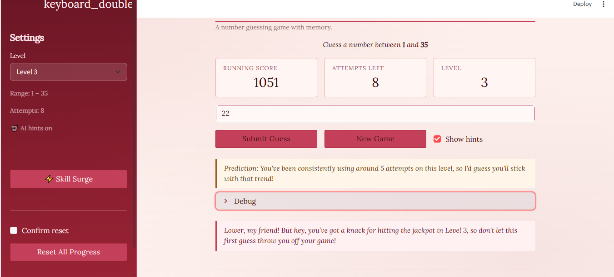
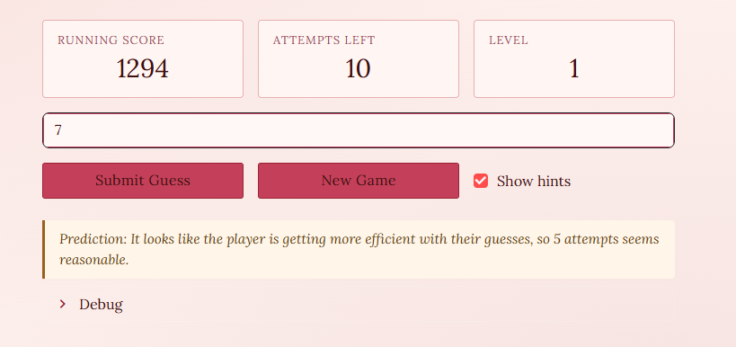
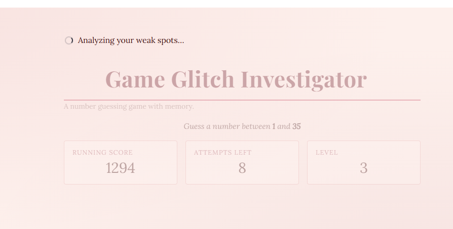
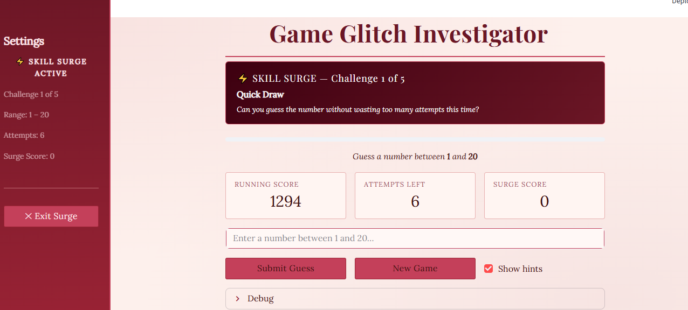

 Game Glitch Investigator: The Impossible Guesser was originally meant to be a simple numbers guessing game that told you if the guessed number was too high or low, or if you won.

## Title and Summary

Title: Number Quest

Summary: The player tries to guess the number given a range and multiple tries. A RAG tool extracts data of the players past games to specialized hints and messages based on past play. There is also a skill building mode implemented based on past weak spots the AI extracts from the game_memory.txt

## Systems Architecture

The app is split across four modules. `app.py` handles the Streamlit UI and session state. `logic_utils.py` contains all pure game rules — level configs, guess checking, and scoring. `rag_hints.py` is the RAG engine: it reads the player's game history from `game_memory.txt` and uses it as context for every OpenAI call, covering mid-game hints, end-of-game reactions, pre-game predictions, achievement detection, level suggestions, and Skill Surge generation. `memory_store.py` manages the memory file — appending completed games, summing the persistent score on load, and clearing history on reset.

See [system_diagram.md](system_diagram.md) for the full UML component and sequence diagrams.

## 🛠️ Setup

**Requirements:** Python 3.10 or higher, an OpenAI API key.

1. **Clone or download** the repository.

2. **Create a virtual environment** (recommended):
   ```bash
   python -m venv venv
   source venv/bin/activate      # Mac/Linux
   venv\Scripts\activate         # Windows
   ```

3. **Install dependencies:**
   ```bash
   pip install -r requirements.txt
   ```

4. **Add your OpenAI API key.** Create a file named `.env` in the project root:
   ```
   OPENAI_API_KEY=your-key-here
   ```
   > If no key is provided the app still runs — AI hints, predictions, achievements, and Skill Surge are silently disabled and static fallback messages are shown instead.

5. **Run the app:**
   ```bash
   python -m streamlit run app.py
   ```
   Then open the local URL printed in the terminal (usually `http://localhost:8501`).

> `game_memory.txt` is created automatically after your first completed game and stores your history and score across sessions.

## 🧠 Design Decisions

### Plain text as the memory store
Game history is stored in a single append-only `game_memory.txt` file rather than a database or vector store. The trade-off is simplicity over scalability — for a single-player local game, a flat file is fast to read, easy to inspect, and requires zero setup. The downside is that as the file grows it gets passed whole to the API, which increases token cost and will eventually hit context limits. A SQLite database or a proper vector store would be the right next step if the game ever went multi-user or needed to handle thousands of sessions.

### RAG over fine-tuning
Rather than fine-tuning a model on game data, every AI response is generated by passing the raw history as context to `gpt-4o-mini` at call time. This means the AI always has the most up-to-date information without any retraining, and the behavior can be changed just by editing prompts. The trade-off is latency and cost per call — every hint, prediction, and achievement check makes a live API request. Fine-tuning would be cheaper per token at scale but would require a training pipeline and would lag behind new player data.

### Persistent score via file summation
The running score is not stored in a separate state file. Instead, `load_total_score()` sums every `Score:` field in `game_memory.txt` on each fresh page load. This keeps a single source of truth and prevents the score from drifting out of sync with history. The trade-off is a small parse cost on startup, which is acceptable for a file that grows by one line per game.

### Prediction falls back to the nearest lower level
If a player has no history on the selected level, the prediction uses the closest lower level they have played rather than staying silent. This keeps the feature useful for players exploring new levels. The trade-off is that the prediction is less accurate — a Level 7 history does not perfectly predict Level 3 performance — so the prompt explicitly tells GPT which level the data came from so the message is transparent about it.

### Skill Surge is GPT-designed, not rule-based
Instead of a fixed algorithm for picking challenge games, the entire Skill Surge config — level selection, reduced attempt limits, challenge names, and taunts — is generated by GPT from the player's history. This produces more personalized and varied challenges than any hand-written rule set. The trade-off is that the output is non-deterministic and has to be validated and clamped after parsing to prevent GPT from returning invalid attempt limits or out-of-range values.

### Streamlit session state for all UI state
All in-game state (secret number, guesses, score, surge progress) lives in `st.session_state`. This is the natural Streamlit pattern and avoids any server-side storage. The trade-off is that a hard page refresh wipes the active game — only completed games are persisted. For a casual single-player game this is acceptable; a production app would serialize in-progress state to a file or cookie.

## 📝 Document Your Experience

- [ ] Describe the game's purpose.
- The purpose of the game is to guess a number, based on hints of higher or lower, or no hints at all. There are multiple difficulty levels that increase/decrease the guessing range. The RAG tool will pull information from past games to give better hints, encourage better gameplay from last games, keep score, and have a special gameplay to improve weak points in skill level.


## 📸 Demo






## Demo Video
<div style="position: relative; padding-bottom: 53.294289897510986%; height: 0;"><iframe src="https://www.loom.com/embed/5435328cfc2348ea845a1944e68fc972" frameborder="0" webkitallowfullscreen mozallowfullscreen allowfullscreen style="position: absolute; top: 0; left: 0; width: 100%; height: 100%;"></iframe></div>
## Testing Summary

What worked: 
   Adding the hints, creating a memory file, and improving gameplay.
What didn't work: 
   Making the hints more descriptive, probably due to not enough memory context availabke and each game is random.
   The surge gameplay being more equipped for hitting weak points in user gameplay. This is a limitation because it is a numbers guessing game, and hard to hit specific weak points.

## Reflection:

   This was built with AI, and required testing across all levels and specific interactions. On the surface, the game appeared to be doing what I wanted, however there were issues such as memory context not being accessed correctly, that needed to be adjusted repeatedly. 

   Working with AI requires repetitive testing and verification, and understanding the code to better pinpoint issues and problem solve.

## Testing:
   Testing is done by human review. I tried multiple levels, and performed purposefully, to make sure predictions based on my performance was accurate, hints made sense, and that the surge level was actually difficult compared to how I played before, and habits I showed.

## Reflections and Ethics:

   Using an AI to engineer code requires attention to detail and constant testing. Certain errors are difficult to spot because on the surface things run smoothly. As an engineer, this project shows my attention to detial, and ability to use AI as a tool and not a simple shortcut.


