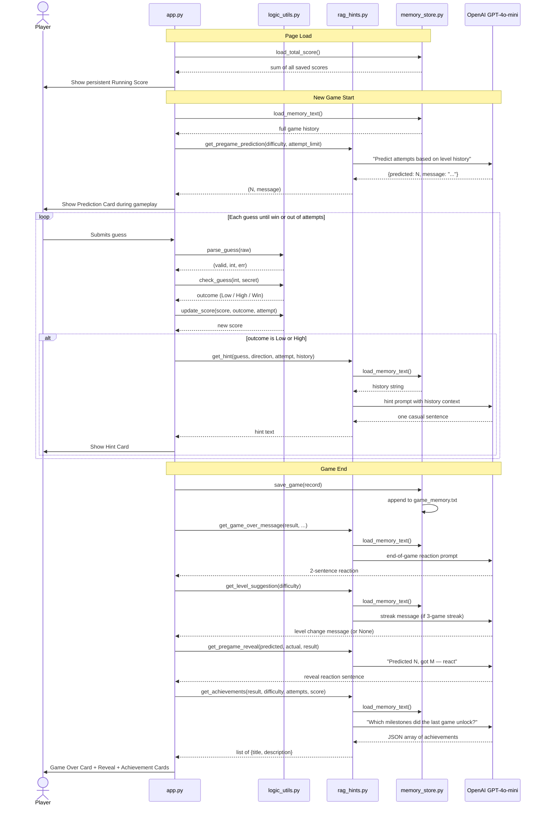
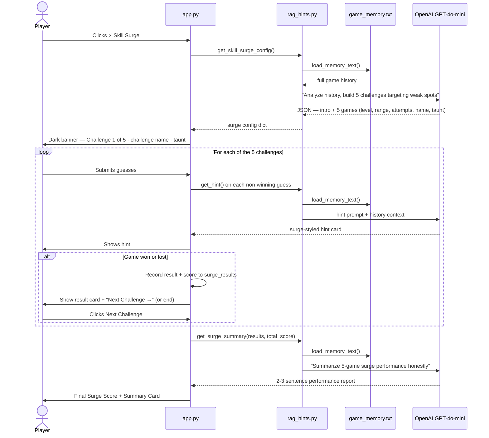

# System Diagram — Game Glitch Investigator

## Component Architecture

```mermaid
flowchart TD
    Player(["👤 Player\n(Browser)"])

    subgraph UI ["🖥️  app.py — Streamlit UI"]
        direction TB
        LvlSelect["Level Selector\nLevel 1 – 10"]
        Input["Guess Input\n+ Submit Button"]
        Metrics["Live Metrics\nRunning Score · Attempts Left · Level"]
        HintCard["Hint Cards\n(styled messages)"]
        PredCard["Prediction Card\n(shown during gameplay)"]
        RevealCard["Prediction Reveal Card\n(shown at game end)"]
        AchCard["Achievement Cards\n(shown at game end)"]
        SurgeBtn["⚡ Skill Surge Button"]
        SurgeUI["Surge Banner\nProgress · Challenge name · Taunt"]
        ResetBtn["Reset All Progress\n(sidebar — requires confirm)"]
    end

    subgraph LOGIC ["⚙️  logic_utils.py — Game Rules"]
        direction TB
        LvlConfig["LEVEL_CONFIG\n10 levels: range + attempt limit"]
        CheckGuess["check_guess()\nLow / High / Win"]
        UpdateScore["update_score()\n+100 win  −5×attempt  −1 wrong"]
        ParseGuess["parse_guess()\ninput validation"]
    end

    subgraph RAG ["🧠  rag_hints.py — RAG Engine"]
        direction TB
        GetHint["get_hint()\nPersonalized mid-game hint"]
        GetMsg["get_game_over_message()\nEnd-of-game reaction"]
        GetLvl["get_level_suggestion()\nAuto level-up / level-down"]
        GetPred["get_pregame_prediction()\nPredict attempt count before game starts"]
        GetReveal["get_pregame_reveal()\nReact to prediction accuracy after game"]
        GetAch["get_achievements()\nDetect newly unlocked badges"]
        GetSurge["get_skill_surge_config()\nDesign 5-game Skill Surge"]
        GetSum["get_surge_summary()\nPost-surge performance report"]
    end

    subgraph MEM ["💾  memory_store.py — Memory Layer"]
        direction TB
        Save["save_game()\nAppend completed game"]
        LoadText["load_memory_text()\nReturn full history as string"]
        LoadScore["load_total_score()\nSum all saved scores"]
        ClearMem["clear_memory()\nDelete memory file"]
        File[("📄 game_memory.txt\n─────────────────────\n[timestamp] Level · Range\nResult · Attempts · Score\nGuesses in order")]
    end

    OpenAI(["🤖 OpenAI API\nGPT-4o-mini"])

    %% Player interactions
    Player -->|"submits guess"| Input
    Player -->|"reads"| HintCard
    Player -->|"reads"| Metrics
    Player -->|"reads"| PredCard

    %% UI ↔ Logic
    Input --> ParseGuess
    ParseGuess --> CheckGuess
    CheckGuess --> UpdateScore
    LvlConfig --> LvlSelect
    UpdateScore -->|"updated score"| Metrics

    %% UI → RAG (in-game)
    Input -->|"on each valid non-winning guess"| GetHint
    UI -->|"on new game start"| GetPred

    %% UI → RAG (on game end)
    UI -->|"on game end"| GetMsg
    UI -->|"on game end"| GetLvl
    UI -->|"on game end"| GetReveal
    UI -->|"after save_game"| GetAch

    %% UI → RAG (surge)
    SurgeBtn -->|"on click"| GetSurge
    UI -->|"after 5th surge game"| GetSum

    %% RAG → Memory
    GetHint --> LoadText
    GetMsg  --> LoadText
    GetLvl  --> LoadText
    GetPred --> LoadText
    GetAch  --> LoadText
    GetSurge --> LoadText
    GetSum  --> LoadText
    LoadText <-->|"read"| File

    %% Memory → UI on session start
    LoadScore -->|"seed total_score on page load"| Metrics
    LoadScore <-->|"read"| File

    %% UI → Memory (save on game end)
    UI -->|"on game end (non-surge only)"| Save
    Save -->|"append"| File

    %% Reset wipes file and session
    ResetBtn -->|"confirmed click"| ClearMem
    ClearMem -->|"delete"| File

    %% RAG → OpenAI
    GetHint   -->|"state + history"| OpenAI
    GetMsg    -->|"result + history"| OpenAI
    GetLvl    -->|"streak context"| OpenAI
    GetPred   -->|"level history → predicted int + message"| OpenAI
    GetReveal -->|"predicted vs actual"| OpenAI
    GetAch    -->|"full history → milestone check"| OpenAI
    GetSurge  -->|"weak-spot analysis → JSON"| OpenAI
    GetSum    -->|"5-game results + history"| OpenAI

    %% OpenAI → UI cards
    OpenAI -->|"personalized text"| HintCard
    OpenAI -->|"prediction message"| PredCard
    OpenAI -->|"reveal reaction"| RevealCard
    OpenAI -->|"badge title + description"| AchCard

    %% Level suggestion auto-changes level
    GetLvl -->|"new level name"| LvlSelect
```



---

## Standard Game — Sequence Diagram



---

## Skill Surge — Sequence Diagram



---

## Data Flows at a Glance

| Trigger | Reads Memory | Calls GPT | Output |
|---|---|---|---|
| Page load | ✅ sums scores | — | Persistent Running Score |
| New game starts | ✅ level history | ✅ | Prediction card (if ≥2 games on level) |
| Player submits guess | ✅ past games | ✅ | Personalized hint card |
| Game ends (win or loss) | ✅ past games | ✅ | End-game reaction message |
| Game ends (3-game streak) | ✅ past games | ✅ | Auto level change |
| Game ends (any) | ✅ full history | ✅ | Prediction reveal card |
| Game ends (any) | ✅ full history | ✅ | Achievement badge cards |
| Skill Surge launched | ✅ past games | ✅ | 5-game challenge config |
| Each Skill Surge guess | ✅ past games | ✅ | Surge-styled hint |
| After 5th surge game | ✅ past games | ✅ | Surge summary report |
| Reset All (confirmed) | — | — | Deletes memory, resets score |

---

## File Map

```
applied-ai-system-final/
│
├── app.py              ← Streamlit UI, session state, surge orchestration
├── logic_utils.py      ← Pure game logic: 10 levels, check / score / parse
├── rag_hints.py        ← RAG engine: all OpenAI calls (hints, prediction,
│                          achievements, level suggestion, surge)
├── memory_store.py     ← Read / write / score / clear game_memory.txt
│
├── game_memory.txt     ← Append-only game history (auto-created)
├── .env                ← OPENAI_API_KEY (gitignored)
│
├── requirements.txt
├── test_logic.py
└── system_diagram.md   ← this file
```
